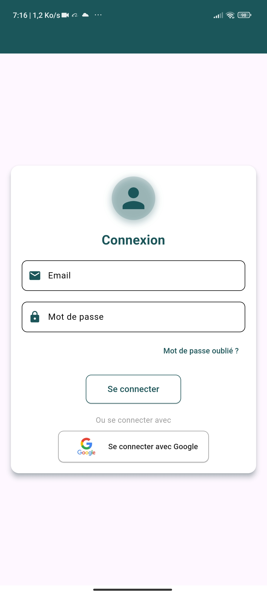

# PersonalExpensesApp

Une application Flutter pour la gestion des dépenses personnelles. Cette application vous permet de suivre vos dépenses, de générer des graphiques, et d’utiliser des fonctionnalités avancées comme les notifications et l’authentification via Firebase.

## Fonctionnalités principales

- **Suivi des dépenses** : Ajoutez, modifiez et supprimez vos dépenses.
- **Visualisation des données** : Utilisation de graphiques interactifs pour analyser vos dépenses.
- **Mode sombre** : Basculer entre les modes clair et sombre pour une meilleure expérience utilisateur.
- **Modification des données personnelles** : Mettez à jour vos informations personnelles.
- **Mode hors ligne** : Utilisez l'application sans connexion Internet.
- **Suppression de compte** : Supprimez votre compte si nécessaire.
- **Modification du mot de passe** : Changez facilement votre mot de passe.
- **Graphiques des dépenses par jour de la semaine** : Analysez vos dépenses quotidiennement.
- **Recherche des transactions** : Recherchez rapidement des transactions spécifiques.
- **Tri des transactions** : Filtrez vos transactions par jour, heure, semaine, prix, etc.
- **Authentification Firebase** : Connectez-vous via Google ou créez un compte.
- **Notifications locales** : Recevez des rappels personnalisés.
- **Préférences partagées** : Sauvegardez vos paramètres localement.

## Prérequis

Avant de commencer, assurez-vous d'avoir :

- Flutter SDK (à jour)
- Un émulateur ou un appareil physique configuré
- Un projet Firebase configuré pour Android et iOS

## Installation

1. Clonez ce dépôt :
   ```bash
   git clone https://github.com/username/personalexpensesapp.git
   cd personalexpensesapp
   ```

2. Installez les dépendances :
   ```bash
   flutter pub get
   ```

3. Configurez Firebase :
   - Ajoutez vos fichiers `google-services.json` (Android) et `GoogleService-Info.plist` (iOS) dans les emplacements appropriés.

4. Générez les icônes et le splash screen :
   ```bash
   flutter pub run flutter_launcher_icons:main
   flutter pub run flutter_native_splash:create
   ```

5. Lancez l'application :
   ```bash
   flutter run
   ```

## Dépendances principales

- **[firebase_core](https://pub.dev/packages/firebase_core)** : Intégration Firebase.
- **[firebase_auth](https://pub.dev/packages/firebase_auth)** : Authentification utilisateur.
- **[cloud_firestore](https://pub.dev/packages/cloud_firestore)** : Base de données en temps réel.
- **[google_sign_in](https://pub.dev/packages/google_sign_in)** : Connexion avec Google.
- **[flutter_local_notifications](https://pub.dev/packages/flutter_local_notifications)** : Notifications locales.
- **[shared_preferences](https://pub.dev/packages/shared_preferences)** : Stockage local.
- **[syncfusion_flutter_charts](https://pub.dev/packages/syncfusion_flutter_charts)** : Graphiques interactifs.
- **[intl](https://pub.dev/packages/intl)** : Gestion des dates et des formats.
- **[provider](https://pub.dev/packages/provider)** : Gestion de l'état.
- **[flutter_animate](https://pub.dev/packages/flutter_animate)** : Animations fluides.
- **[fl_chart](https://pub.dev/packages/fl_chart)** : Graphiques personnalisés.

## Structure des dossiers

- **`lib/`** : Contient le code source principal.
  - **`screens/`** : Écrans de l'application.
  - **`models/`** : Modèles de données.
  - **`widgets/`** : Widgets réutilisables.
  - **`services/`** : Intégrations Firebase et autres services.
- **`assets/`** : Ressources statiques (images, polices, etc.).
- **`fonts/`** : Polices personnalisées.

## Personnalisation

### Modifier les icônes de l'application

1. Mettez à jour l'image dans `assets/images/app_logo.png`.
2. Exécutez :
   ```bash
   flutter pub run flutter_launcher_icons:main
   ```

### Modifier le Splash Screen

1. Modifiez la configuration dans `pubspec.yaml` sous `flutter_native_splash`.
2. Exécutez :
   ```bash
   flutter pub run flutter_native_splash:create
   ```

## Contribution

Les contributions sont les bienvenues !

1. Forkez le projet.
2. Créez une branche pour votre fonctionnalité :
   ```bash
   git checkout -b feature/awesome_feature
   ```
3. Effectuez vos modifications et commitez-les :
   ```bash
   git commit -m "Add awesome feature"
   ```
4. Poussez la branche :
   ```bash
   git push origin feature/awesome_feature
   ```
5. Créez une Pull Request.

## Licence

Ce projet est sous licence [MIT](LICENSE).

---

### Auther
  [Foko Junior](https://github.com/FokoJunior)

  [Mickael Ivan](https://github.com/mike2377)

### Contact

Pour toute question ou suggestion, contactez-nous à :
- **Email** :<br>           
        [benitojunior2022@gmail.com](mailto:benitojunior2022@gmail.com). <br><br>
        [mike2377@gmail.com](mailto:mike2377@gmail.com)


- **GitHub** : [PersonalExpensesApp](https://github.com/mike2377/personalexpenses)


### Demo Screenshots

 


### Demo Video
<video src="assets/img/video.mp4" controls target="_blank" height="500" width="2">

Votre navigateur ne supporte pas la balise vidéo

</video>
